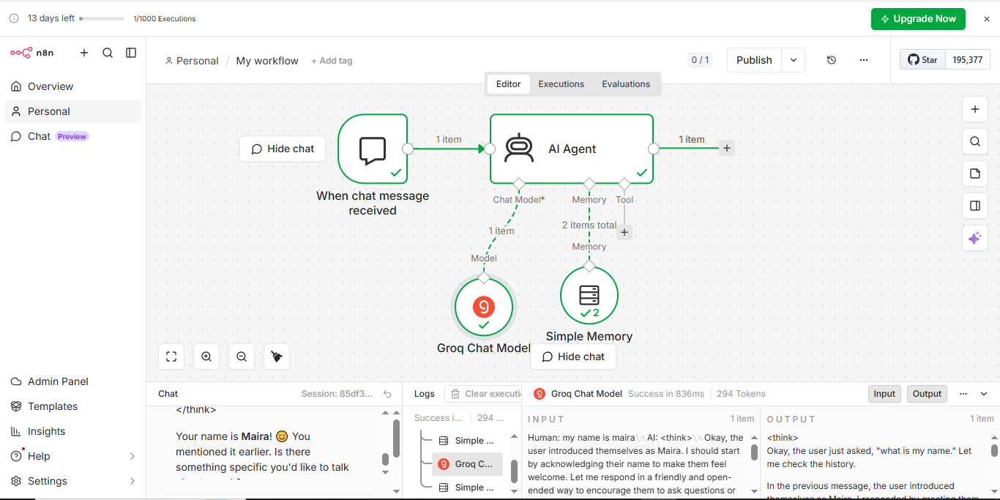

# notes:

## Ai Automation:

When we perform repetitive tasks using artificial intelegince with minimum human efforts .Its called ai autmation.e.g.CHATBOT

we require it to increase reproductivy ,for Better costumar experience

ai automation USES LLM(Large language model)

# ADVANTAGES:

World is adopting ai automation because of following advantages

speed,scalebility,accuracy ,smart decision making.

It has many real world applications for example we use it in banks to detect frauds ,in hospitals  etc

# TOOLS:

AI AUTOMATION has many tools.Commonly we use n8n and OPEN AI APP.

# TRIGGER NODE:

When we execute trigger node our workflow starts working.

## types of trigger node:

It has fllowing types:

### Trigger manualy:

it works manually.

### On a schedule:

it works on a fixed time which we set.

### On app event: 

it runs the flow on app.

### Webhook call :

it runs the workflow when it receive http code

### On chat message:

it runs the worksflow when recieved message.

### By another workflow: 

it executed after one workflow runs.

### On form submission:

it runs the flow when form submitted on google.

## ai agent

on this workflow we use ON CHAT TRIGGER  then we use ai agent .With that we we use sub node

 

 
